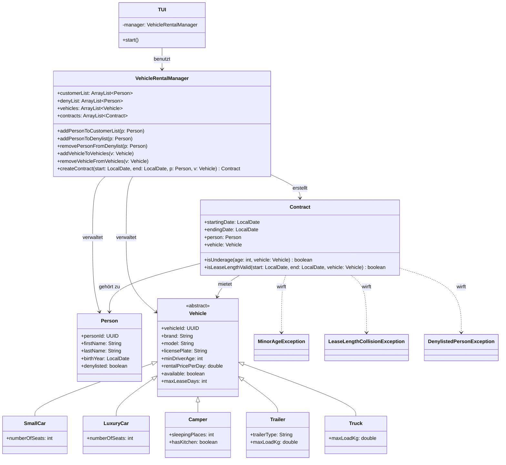

# Einfaches UML-Klassendiagramm

```mermaid
classDiagram
    direction TB

    class VehicleRentalManager {
        +customerList: ArrayList~Person~
        +denyList: ArrayList~Person~
        +vehicles: ArrayList~Vehicle~
        +contracts: ArrayList~Contract~
        +addPersonToCustomerList(p: Person)
        +addPersonToDenylist(p: Person)
        +removePersonFromDenylist(p: Person)
        +addVehicleToVehicles(v: Vehicle)
        +removeVehicleFromVehicles(v: Vehicle)
        +createContract(start: LocalDate, end: LocalDate, p: Person, v: Vehicle) Contract
    }

    class TUI {
        -manager: VehicleRentalManager
        +start()
    }

    class Person {
        +personId: UUID
        +firstName: String
        +lastName: String
        +birthYear: LocalDate
        +denylisted: boolean
    }

    class Contract {
        +startingDate: LocalDate
        +endingDate: LocalDate
        +person: Person
        +vehicle: Vehicle
        +isUnderage(age: int, vehicle: Vehicle) boolean
        +isLeaseLengthValid(start: LocalDate, end: LocalDate, vehicle: Vehicle) boolean
    }

    class Vehicle {
        <<abstract>>
        +vehicleId: UUID
        +brand: String
        +model: String
        +licensePlate: String
        +minDriverAge: int
        +rentalPricePerDay: double
        +available: boolean
        +maxLeaseDays: int
    }

    class SmallCar {
        +numberOfSeats: int
    }

    class LuxuryCar {
        +numberOfSeats: int
    }

    class Camper {
        +sleepingPlaces: int
        +hasKitchen: boolean
    }

    class Trailer {
        +trailerType: String
        +maxLoadKg: double
    }

    class Truck {
        +maxLoadKg: double
    }

    class MinorAgeException
    class LeaseLengthCollisionException
    class DenylistedPersonException

    VehicleRentalManager --> Person : verwaltet
    VehicleRentalManager --> Vehicle : verwaltet
    VehicleRentalManager --> Contract : erstellt
    TUI --> VehicleRentalManager : benutzt

    Contract --> Person : gehört zu
    Contract --> Vehicle : mietet

    Vehicle <|-- SmallCar
    Vehicle <|-- LuxuryCar
    Vehicle <|-- Camper
    Vehicle <|-- Trailer
    Vehicle <|-- Truck

    Contract ..> MinorAgeException : wirft
    Contract ..> LeaseLengthCollisionException : wirft
    Contract ..> DenylistedPersonException : wirft
```