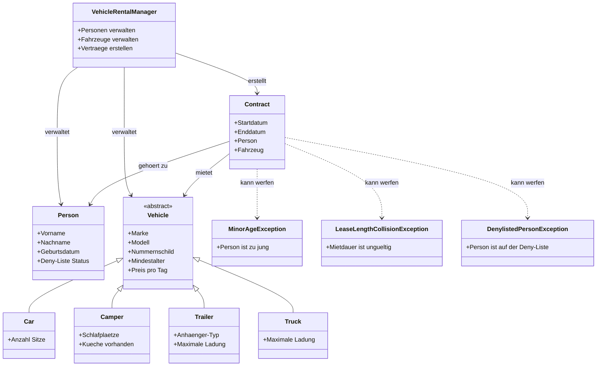

# Einfaches UML-Klassendiagramm

```mermaid
classDiagram
    direction TB

    class VehicleRentalManager {
        +Personen verwalten
        +Fahrzeuge verwalten
        +Vertraege erstellen
    }

    class Person {
        +Vorname
        +Nachname
        +Geburtsdatum
        +Deny-Liste Status
    }

    class Contract {
        +Startdatum
        +Enddatum
        +Person
        +Fahrzeug
    }

    class Vehicle {
        <<abstract>>
        +Marke
        +Modell
        +Nummernschild
        +Mindestalter
        +Preis pro Tag
    }

    class Car {
        +Anzahl Sitze
    }

    class Camper {
        +Schlafplaetze
        +Kueche vorhanden
    }

    class Trailer {
        +Anhaenger-Typ
        +Maximale Ladung
    }

    class Truck {
        +Maximale Ladung
    }

    class MinorAgeException {
        +Person ist zu jung
    }

    class LeaseLengthCollisionException {
        +Mietdauer ist ungueltig
    }

    class DenylistedPersonException {
        +Person ist auf der Deny-Liste
    }

    VehicleRentalManager --> Person : verwaltet
    VehicleRentalManager --> Vehicle : verwaltet
    VehicleRentalManager --> Contract : erstellt

    Contract --> Person : gehoert zu
    Contract --> Vehicle : mietet

    Vehicle <|-- Car
    Vehicle <|-- Camper
    Vehicle <|-- Trailer
    Vehicle <|-- Truck

    Contract ..> MinorAgeException : kann werfen
    Contract ..> LeaseLengthCollisionException : kann werfen
    Contract ..> DenylistedPersonException : kann werfen
```

